# AWSでRailsアプリケーションを構築
## 概要
無料枠の範囲内でAWS環境構築を実施。  
AWS環境構築完了後、RailsアプリケーションをEC2に構築しアプリケーションが動くことを確認。  
※マルチAZ構成は有料枠なので一旦はシングルAZ構成で作成  

### VPC環境構築
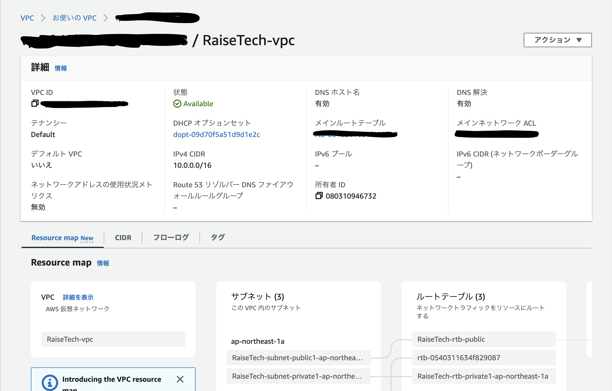  

### EC2環境構築
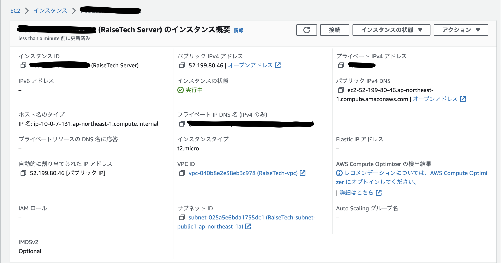  

### RDS環境構築
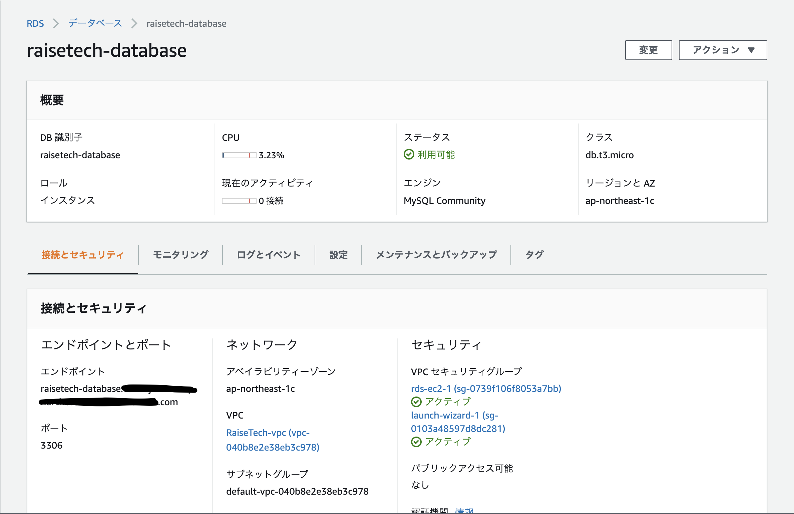  

1. RDS接続確認
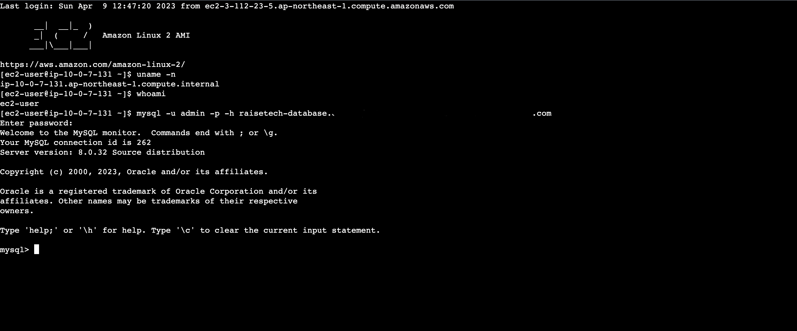  

### Railsアプリケーションを構築  

1. rails server -b 0.0.0.0　コマンド  
　　→[EC2アプリケーションデプロイ](Construction/EC2.md)  
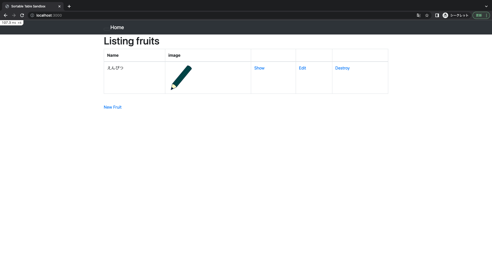  

2. Web/APサーバの構築  
　　→[Web/APサーバの構築](Construction/Web・AP.md)  
2.1 Unicorn起動  
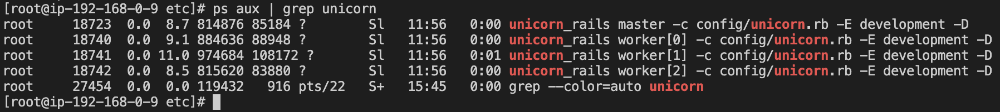  

2.2 Nginx起動  
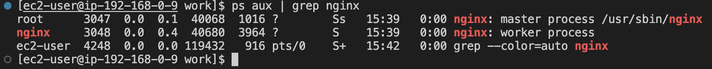  

2.3 動作確認  
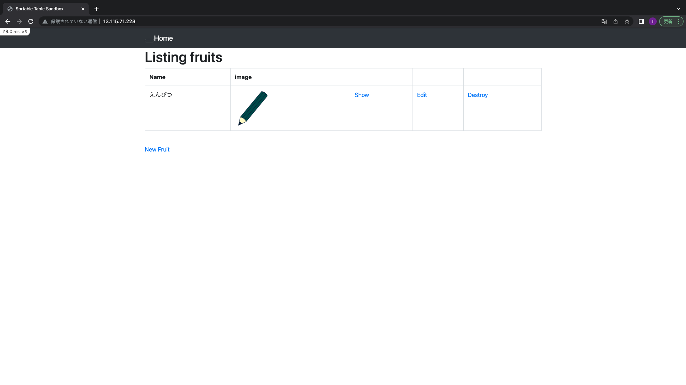  

3. ALB構築  
DNS nameでWebサイトにアクセス  
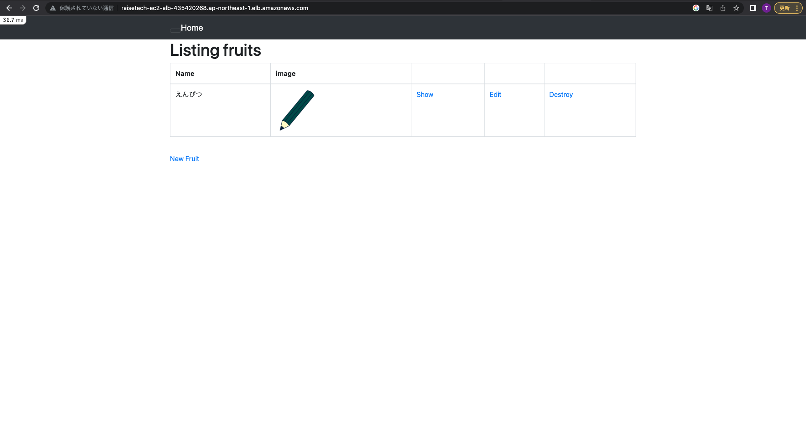  

4. S3構築  
　　→[S3構築](Construction/S3.md)  
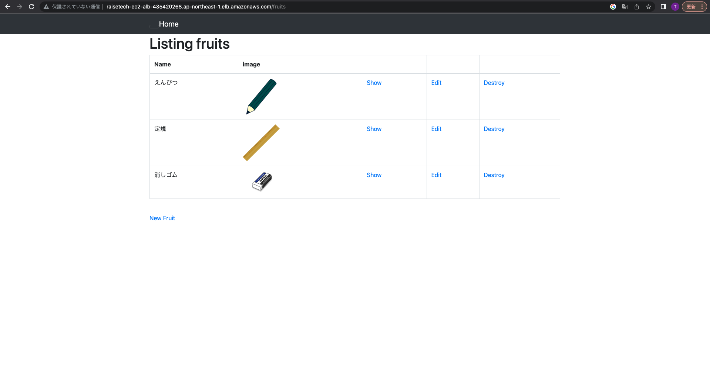  
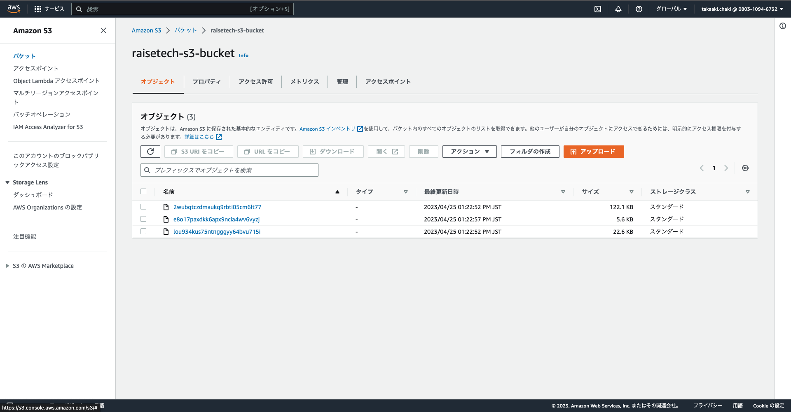  

5. 構成図  
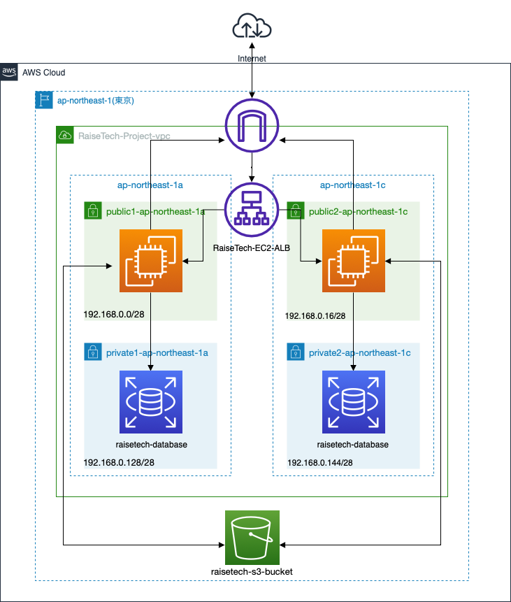  
