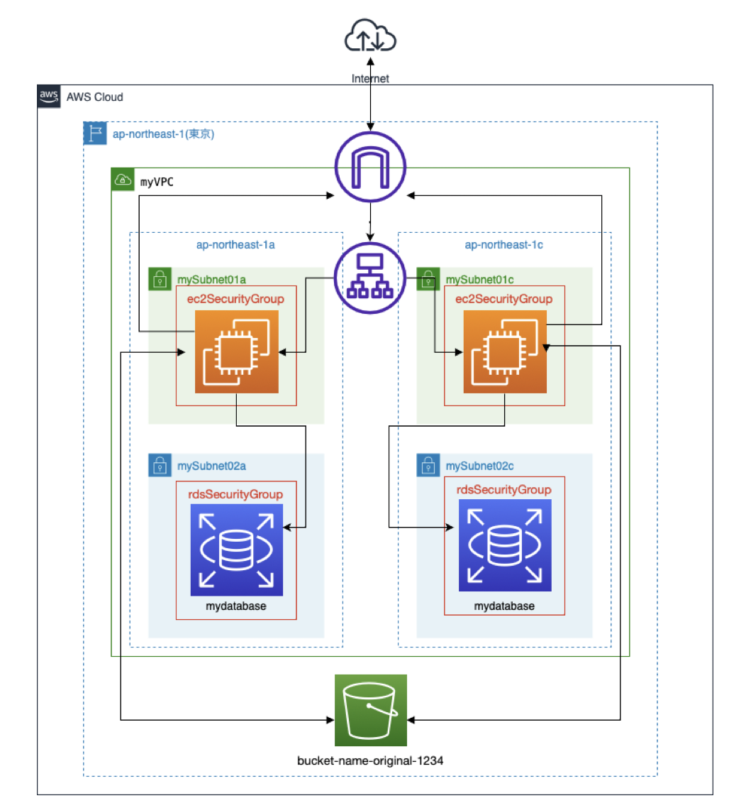
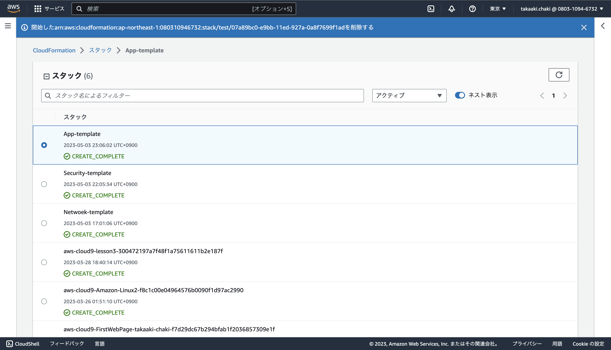
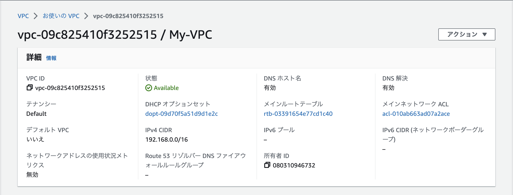
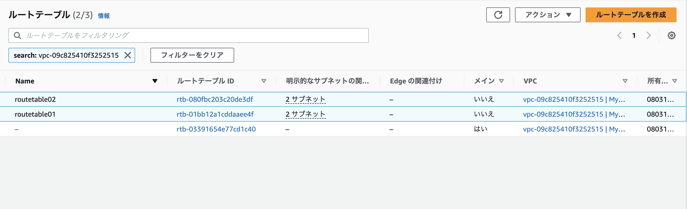
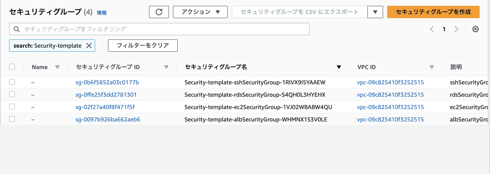
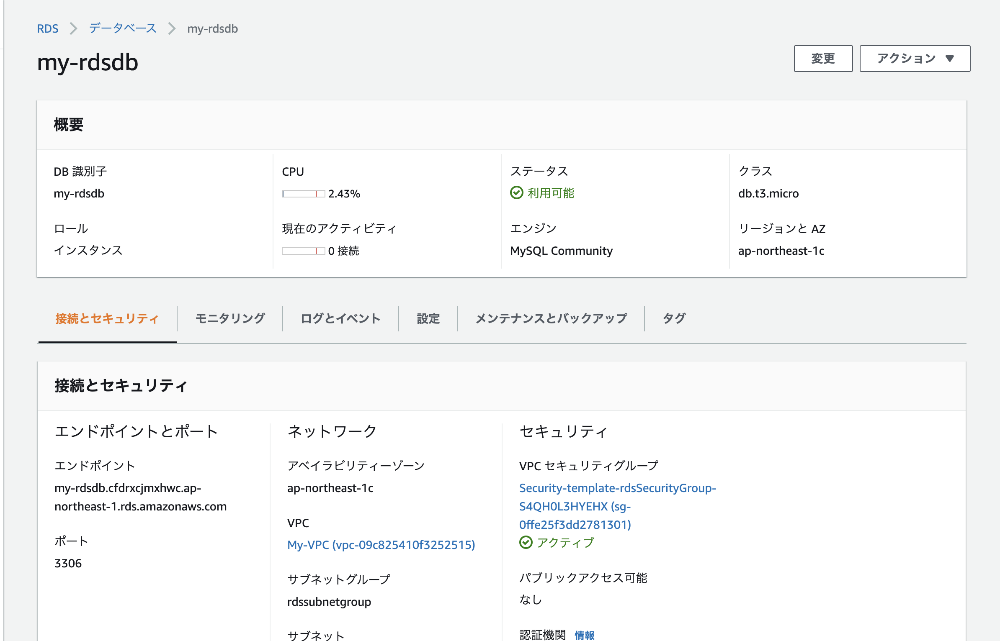
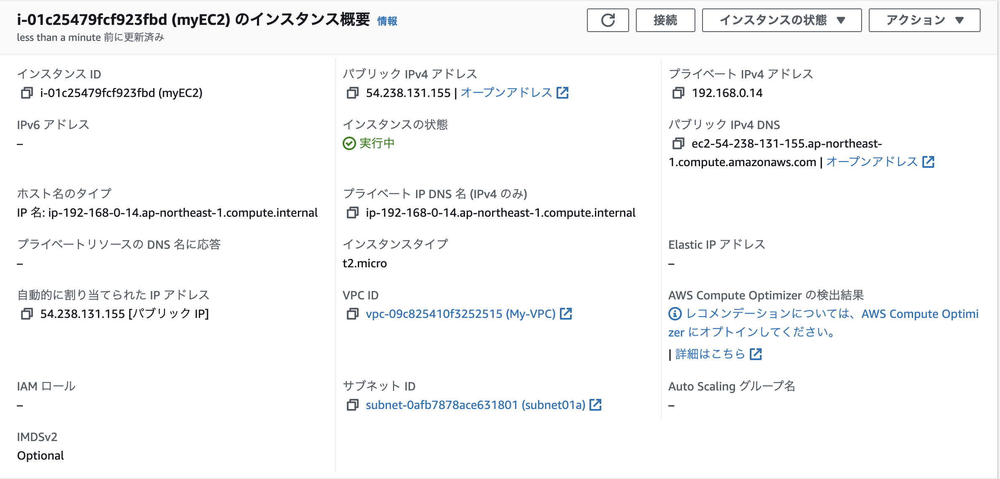
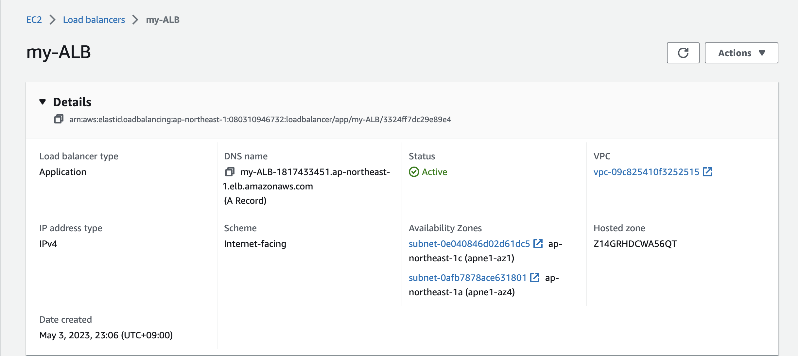
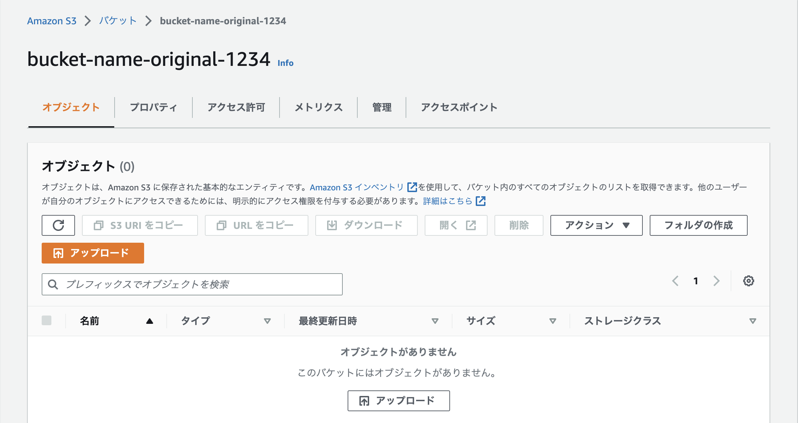

# CloudFormationを利用した環境構築
## 概要
無料枠の範囲内でAWS環境構築を実施。
※マルチAZ構成は有料枠なので一旦はシングルAZ構成で作成

### VPC
|項目|内容|
| :--- | :--- |
|CIDRブロック|192.168.0.0/16|
|DNS機能|有効|
|DNS名割り当て|有効|

### Subnet
|VPCセグメント|サブネット名|AZ|備考|
| :--- | :--- | :--- | :--- |
|192.168.0.0/28|mySubnet01a|ap-northeast-1a|パブリック|
|192.168.0.128/28|mySubnet01c|ap-northeast-1c|パブリック|
|192.168.0.16/28|mySubnet02a|ap-northeast-1a|プライベート|
|192.168.0.144/28|mySubnet02c|ap-northeast-1c|プライベート|

### SecurityGroup
#### ec2用
|プロトコル|ポート番号|用途|
| :--- | :--- | :--- |
|tcp|22|ssh|
|tcp|80|http|
|tcp|8080|Webサーバ接続|
|tcp|443|https|
|tcp|3000|rails接続|

#### alb用
|プロトコル|ポート番号|用途|
| :--- | :--- | :--- |
|tcp|80|http接続|

#### rds用
|プロトコル|ポート番号|用途|
| :--- | :--- | :--- |
|tcp|3306|mysql接続|

## 構成図
 

## 実施結果
1. CloudFormation  
  

2. VPC  
  

3. ルートテーブル
  

4. セキュリティグループ
  

5. RDS  
  

6. EC2  
  

7. ALB
  

8. S3  
  

### その他
作成したソースコード格納先  
[Network](../source/Network-properties.yml)  
[Security](../source/Security-properties.yml)  
[Application](../source/App-properties.yml)  
