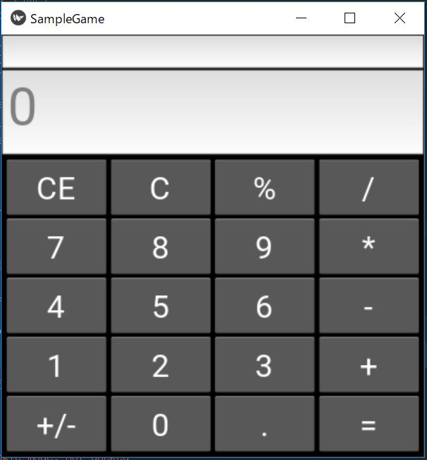
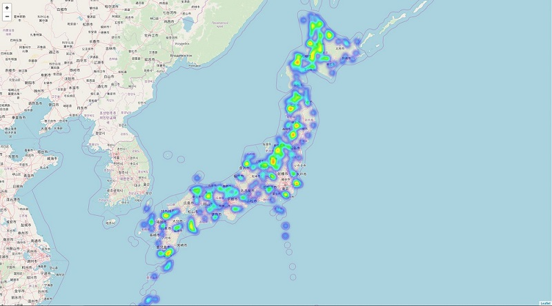
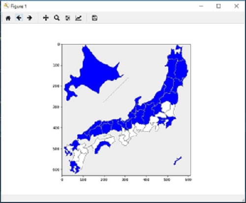

# ポートフォリオ

## AWS
1. AWSでRailsアプリケーションを構築  
   → [AWS-Rails](AWS-Rails/README.md)  

2. CloudFormationを使った構築  
   → [CloudFormation](CloudFormation/README.md)  

## Python
1. 計算機  
   [ソースコード](Python/Calculation/Calculation.py)  
   

2. マップ作成ツール  
   ヒートマップ  
   [ソースコード](Python/Map/Heatmap/Heatmap_Create.py)  
     

   日本地図  
   [ソースコード](Python/Map/Japanmap/Japan_Map.py)  
     

3. Web-Scraping  
   → [ソースコード](Python/Web-Scraping/Google_search-checkpoint.ipynb)  
   → [出力結果](Python/Web-Scraping/Google_search_result-checkpoint.csv)  
